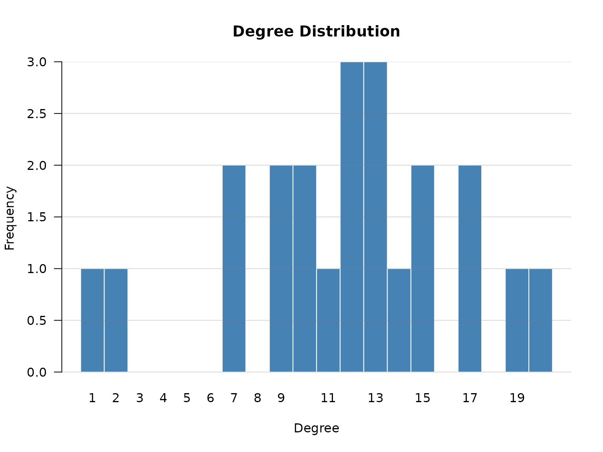
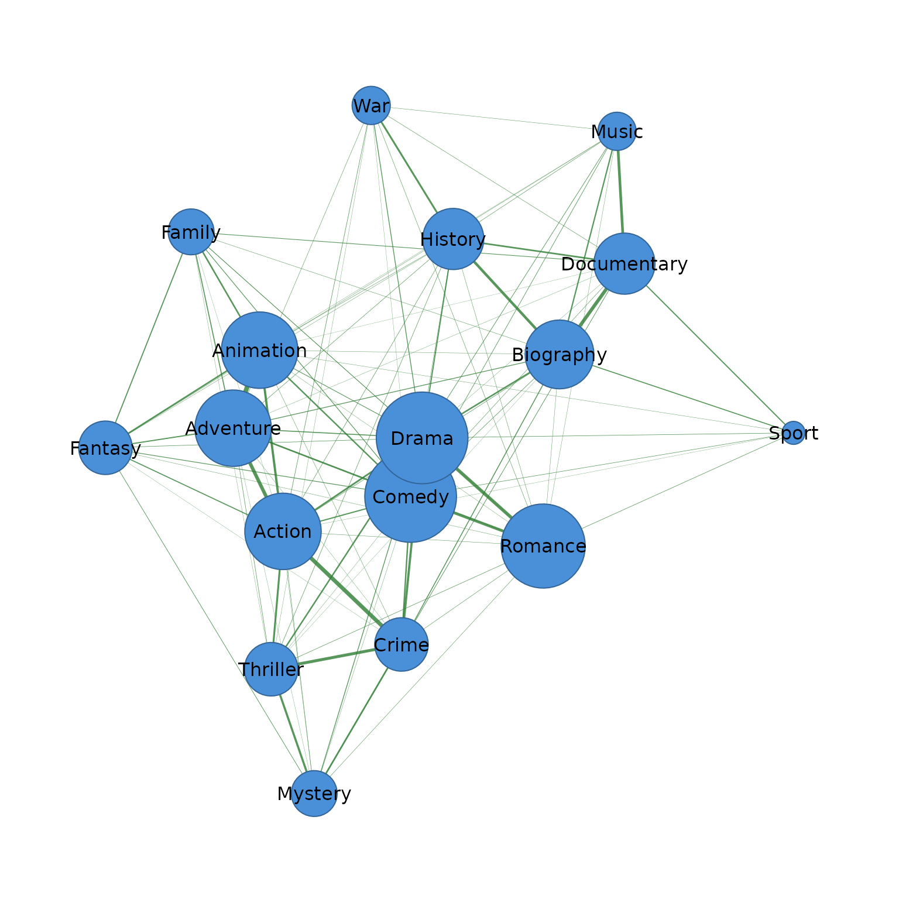
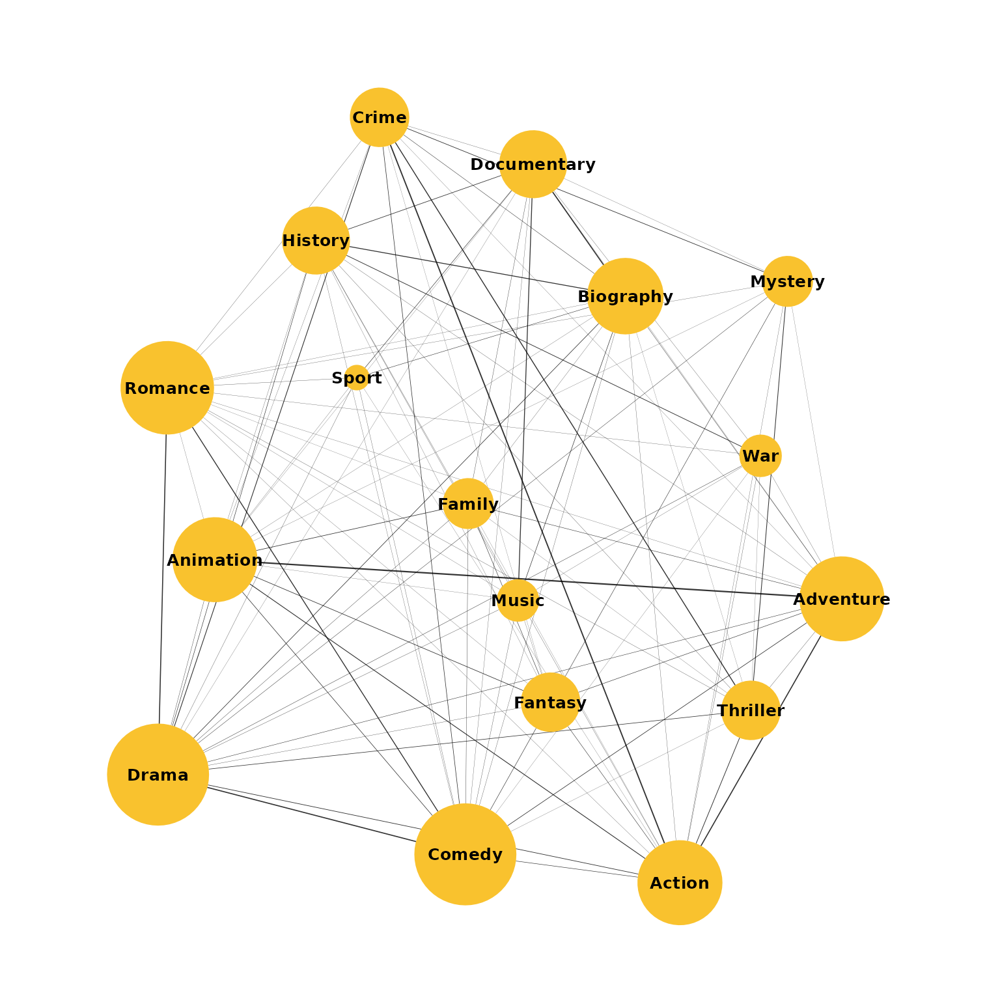
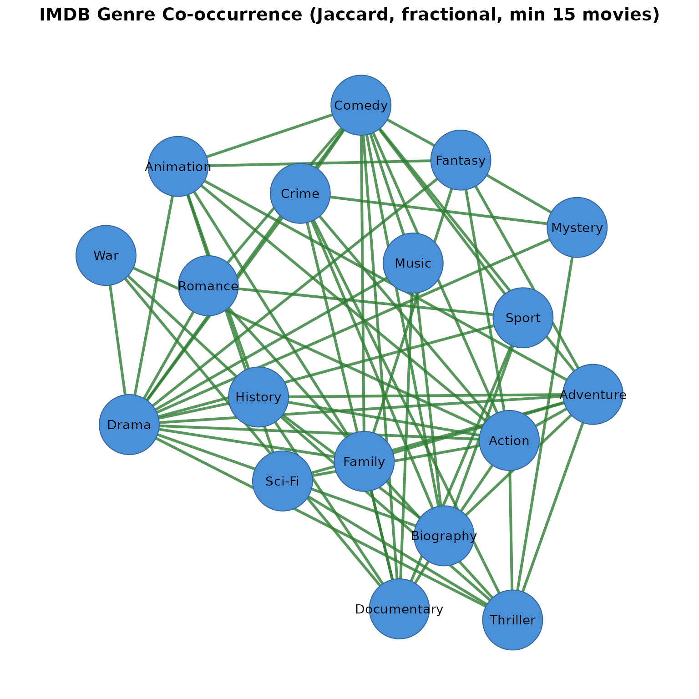

# Co-occurrence Networks with IMDB Movie Data

This tutorial demonstrates every feature of the `cooccur` package using
1,000 highly-rated IMDB movies (rating $\geq$ 7.0, $\geq$ 1,000 votes,
1970–2024).

Starting from raw tabular data, we build genre co-occurrence networks,
construct actor collaboration networks, compare co-occurrence patterns
across decades and rating bands, apply different similarity measures and
counting methods, and export results to `Gephi`, `igraph`, and `cograph`
for visualization and downstream analysis.

## Data

``` r
library(cooccur)
```

The dataset contains the title of the movie, the year and decade, the
`genres` (comma-separated), the average rating, the number of votes, and
the rating band.

``` r
head(movies)
#>       tconst                          primaryTitle startYear
#> 1  tt0118117                       The War at Home      1996
#> 2 tt10534996                                 Josep      2020
#> 3  tt4686844                   The Death of Stalin      2017
#> 4  tt0089957 Samaya obayatelnaya i privlekatelnaya      1985
#> 5  tt3469964                         Blind Massage      2014
#> 6  tt7647198                       Love and Shukla      2017
#>                      genres decade averageRating numVotes
#> 1                     Drama  1990s           7.0     2733
#> 2 Animation,Biography,Drama  2020s           7.4     2340
#> 3      Comedy,Drama,History  2010s           7.3   126237
#> 4            Comedy,Romance  1980s           7.4     2521
#> 5                     Drama  2010s           7.2     1804
#> 6      Comedy,Drama,Romance  2010s           7.2     1234
```

## 1. Genre co-occurrence (delimited field)

Each movie has a comma-delimited `genres` column, where genres that
appear in the same movie are connected. To analyze their co-occurrence
we need to call `cooccurrence` and specify the `field` argument
specifying the column and `sep` specifying the delimiter that separates
values within that field.

``` r
cooccurrence(movies, field = "genres", sep = ",")
#> # cooccurrence: 22 nodes, 129 edges (1000 transactions)
#>       from          to weight count
#>     Comedy       Drama    159   159
#>      Drama     Romance    131   131
#>      Crime       Drama     91    91
#>     Action       Drama     71    71
#>     Comedy     Romance     63    63
#>     Action       Crime     59    59
#>  Biography       Drama     59    59
#>      Drama    Thriller     57    57
#>     Action   Adventure     44    44
#>  Biography Documentary     44    44
#> # ... 119 more edges
```

The result shows 22 genre nodes and 129 edges. *Drama* dominates the top
pairs simply because it is the most frequent genre, inflating
co-occurrence with nearly every other genre regardless of actual
association strength. Jaccard similarity normalizes for this, so the
strongest edges reflect true affinity rather than frequency. A directed
co-occurrence graph is then built and its degree distribution plotted as
a bar chart, showing how many nodes share each degree value and whether
connectivity is concentrated or evenly spread across genres.

``` r
library(cograph)

Net <- co(movies, field = "genres", sep = ",", similarity = "jaccard")

Gr<- as_cograph(Net, directed = TRUE)

cograph::degree_distribution(Gr)
```



### Comparing similarity measures

Each similarity measure surfaces different structure in the data,
prioritizing different aspects of co-occurrence. The examples below show
the top 3 pairs under each measure using a movie genres dataset.

`similarity = "none"` — Raw counts favor the most frequent genre pairs.
*Drama* dominates because it is the most common genre, so its
co-occurrences with *Comedy* and *Romance* rank highest regardless of
how strongly the genres are actually associated.

``` r
co(movies, field = "genres", sep = ",", similarity = "none", top_n = 3)
#> # cooccurrence: 4 nodes, 3 edges (1000 transactions)
#>    from      to weight count
#>  Comedy   Drama    159   159
#>   Drama Romance    131   131
#>   Crime   Drama     91    91
```

`similarity = "jaccard"` — Normalizing by the union of occurrences
brings less frequent but more tightly associated pairs to the top.
*Adventure*–*Animation* emerges as the strongest pair, suggesting these
genres appear together more consistently relative to how often either
appears alone.

``` r
co(movies, field = "genres", sep = ",", similarity = "jaccard", top_n = 3)
#> # cooccurrence: 6 nodes, 3 edges (1000 transactions) | similarity: jaccard
#>       from        to    weight count
#>  Adventure Animation 0.2846715    39
#>     Action     Crime 0.2369478    59
#>     Comedy     Drama 0.2111554   159
```

`similarity = "cosine"` — Similar to Jaccard but less strict, cosine
also elevates *Adventure*–*Animation* while keeping *Drama*–*Romance* in
the top 3, reflecting its more lenient treatment of frequency
differences between genres.

``` r
co(movies, field = "genres", sep = ",", similarity = "cosine", top_n = 3)
#> # cooccurrence: 6 nodes, 3 edges (1000 transactions) | similarity: cosine
#>       from        to    weight count
#>  Adventure Animation 0.4480983    39
#>      Drama   Romance 0.4113075   131
#>     Action     Crime 0.3831250    59
```

`similarity = "inclusion"` — — Dividing by the less common genre’s
frequency surfaces subset relationships. *Documentary*–*News* and
*History*–*News* both score 1, meaning *News* movies are always also
tagged as *Documentary* or *History*—*News* is a niche genre that only
appears alongside broader ones.

``` r
co(movies, field = "genres", sep = ",", similarity = "inclusion", top_n = 3)
#> # cooccurrence: 5 nodes, 3 edges (1000 transactions) | similarity: inclusion
#>         from      to weight count
#>  Documentary    News      1     1
#>      History    News      1     1
#>        Drama Western      1     1
```

`similarity = "association"` — Discounting by the product of individual
frequencies reveals pairs that co-occur far more than chance would
predict. Rare genre combinations like History–News and Documentary–News
top the list because their co-occurrence is disproportionately high
relative to their individual frequencies.

``` r
co(movies, field = "genres", sep = ",", similarity = "association", top_n = 3)
#> # cooccurrence: 5 nodes, 3 edges (1000 transactions) | similarity: association
#>         from     to      weight count
#>      History   News 0.016129032     1
#>       Horror Sci-Fi 0.011363636     2
#>  Documentary   News 0.006578947     1
```

`similarity = "dice"` — Results closely mirror Jaccard, with the same
top pairs appearing in the same order but with slightly higher weights —
reflecting Dice’s more lenient arithmetic mean normalization.
*Adventure*-*Animation*, *Action*-*Crime*, and *Comedy*-*Drama* remain
the strongest genre affinities, with *Comedy*-*Drama* recording the
highest raw co-occurrence count at 159 despite its comparatively lower
weight, indicating that both genres are individually common but not
exclusively paired.

``` r
co(movies, field = "genres", sep = ",", similarity = "dice", top_n = 3)
#> # cooccurrence: 6 nodes, 3 edges (1000 transactions) | similarity: dice
#>       from        to    weight count
#>  Adventure Animation 0.4431818    39
#>     Action     Crime 0.3831169    59
#>     Comedy     Drama 0.3486842   159
```

`similarity = "equivalence"` — Squaring the cosine amplifies differences
between strong and weak pairs, pushing weaker associations further down
the rankings. *Adventure*-*Animation* retains the top spot, but
*Drama*–*Romance* displaces *Action*-*Crime* into third place,
suggesting that while *Action*-*Crime* has a higher raw count,
*Drama*–*Romance* represents a tighter and more exclusive pairing once
the penalty for common genres is compounded.

``` r
co(movies, field = "genres", sep = ",", similarity = "equivalence", top_n = 3)
#> # cooccurrence: 6 nodes, 3 edges (1000 transactions) | similarity: equivalence
#>       from        to    weight count
#>  Adventure Animation 0.2007921    39
#>      Drama   Romance 0.1691739   131
#>     Action     Crime 0.1467847    59
```

### Which similarity to use?

- **Exploratory work**: Start with `"none"` to see raw counts and
  understand the data, then try `"jaccard"` or `"cosine"` for a balanced
  view.
- **Bibliometric and scientometric networks**: `"association"` is
  recommended by van Eck & Waltman (2009) because it correctly accounts
  for the expected number of co-occurrences under independence. Two
  items that are both very frequent will naturally co-occur often;
  association strength discounts this, revealing which pairs co-occur
  *more than chance alone would predict*.
- **Detecting hierarchical or subset structure**: `"inclusion"` (the
  Simpson coefficient) reveals when one item almost always appears with
  another — useful for identifying items that are subsets of broader
  categories, or for detecting dependency relationships.
- **Binary presence/absence networks**: `"jaccard"` or `"dice"` when you
  only care *whether* items co-occur, not *how often*. Jaccard is
  stricter (penalizes unbalanced pairs more); Dice is more lenient.
- **Scale-invariant comparison**: `"cosine"` is invariant to absolute
  frequency — useful when comparing co-occurrence patterns across
  datasets of different sizes.
- **Strict filtering**: `"equivalence"` (cosine squared) amplifies
  differences — pairs with weak overlap get pushed closer to zero,
  retaining only the strongest associations.

## 2. Counting methods

By default, each transaction contributes equally to co-occurrence
counts: if a movie has genres A, B, and C, each pair adds 1. This means
movies with many genres inflate the network — a 5-genre movie creates 10
pairs, while a 2-genre movie creates only 1, giving multi-genre movies
disproportionate influence.

**Fractional counting** addresses this by weighting each pair by
$1/(n - 1)$, where $n$ is the number of items in the transaction, so
every transaction contributes equally regardless of how many genres it
contains.

``` r
co(movies, field = "genres", sep = ",", top_n = 5)
#> # cooccurrence: 5 nodes, 5 edges (1000 transactions)
#>    from      to weight count
#>  Comedy   Drama    159   159
#>   Drama Romance    131   131
#>   Crime   Drama     91    91
#>  Action   Drama     71    71
#>  Comedy Romance     63    63
```

``` r
co(movies, field = "genres", sep = ",", counting = "fractional", top_n = 5)
#> # cooccurrence: 5 nodes, 5 edges (1000 transactions)
#>    from      to weight count
#>  Comedy   Drama  107.5   159
#>   Drama Romance   94.5   131
#>   Crime   Drama   52.5    91
#>  Action   Drama   38.5    71
#>  Comedy Romance   38.5    63
```

The top pairs remain the same under both methods, but the weights are
lower under fractional counting. For example, *Comedy*-*Drama* drops
from 159 to 107.5, reflecting the downweighting of multi-genre movies
that contributed to this pair. Fractional counting is particularly
important when some transactions contain many items while others contain
few, as it prevents high-cardinality transactions from dominating the
network.

## 3. Scaling

Scaling compresses or transforms the weight distribution after
similarity normalization, making it easier to visualize or use in
downstream analysis. Scaling can be applied on its own or combined with
any similarity measure.

`scale = "log"` — Applies a natural log transformation, compressing the
heavy tail of the distribution. The ranking of pairs is preserved but
the gap between frequent and infrequent pairs is reduced.
*Comedy*-*Drama* and Drama*-*Romance\* remain at the top, but their
weights are now much closer together than raw counts would suggest.

``` r
co(movies, field = "genres", sep = ",", scale = "log", top_n = 5)
#> # cooccurrence: 5 nodes, 5 edges (1000 transactions) | scale: log
#>    from      to   weight count
#>  Comedy   Drama 5.075174   159
#>   Drama Romance 4.882802   131
#>   Crime   Drama 4.521789    91
#>  Action   Drama 4.276666    71
#>  Comedy Romance 4.158883    63
```

`scale = "minmax"` — Rescales all weights to the range \[0, 1\], where
the strongest pair scores 1 and all others are expressed relative to it.
Useful for comparing networks of different sizes or when absolute counts
are not meaningful. *Adventure*-*Animation* scores a perfect 1 as the
strongest Jaccard pair in the network. *Biography*-*Documentary* reaches
the top 5 with a raw count of only 44, indicating that when these genres
appear together they do so with high exclusivity relative to how often
either appears alone.

``` r
co(movies, field = "genres", sep = ",", similarity = "jaccard", scale = "minmax", top_n = 5)
#> # cooccurrence: 8 nodes, 5 edges (1000 transactions) | similarity: jaccard | scale: minmax
#>       from          to    weight count
#>  Adventure   Animation 1.0000000    39
#>     Action       Crime 0.8314210    59
#>     Comedy       Drama 0.7403121   159
#>     Action   Adventure 0.7275665    44
#>  Biography Documentary 0.7139898    44
```

`scale = "binary"` — Converts all positive weights to 1, producing a
presence/absence network. The top pairs are no longer ranked by strength
but simply by whether they co-occur at all. *Action*-*Adventure*
dominate simply because they appear together across a wide range of
combinations.

``` r
co(movies, field = "genres", sep = ",", scale = "binary", top_n = 5)
#> # cooccurrence: 4 nodes, 5 edges (1000 transactions) | scale: binary
#>       from        to weight count
#>     Action Adventure      1    44
#>     Action Animation      1    27
#>  Adventure Animation      1    39
#>     Action Biography      1     5
#>  Adventure Biography      1     8
```

`scale = "sqrt"` — Applies a square root transformation, providing a
milder compression than log. The ranking is preserved and the
distribution is slightly less skewed than the raw counts.
*Comedy*-*Drama* leads with a weight of 12.6 compared to
*Comedy*-*Romance* at 7.9, a smaller proportional gap than the raw count
difference of 159 versus 63 would imply.

``` r
co(movies, field = "genres", sep = ",", scale = "sqrt", top_n = 5)
#> # cooccurrence: 5 nodes, 5 edges (1000 transactions) | scale: sqrt
#>    from      to    weight count
#>  Comedy   Drama 12.609520   159
#>   Drama Romance 11.445523   131
#>   Crime   Drama  9.539392    91
#>  Action   Drama  8.426150    71
#>  Comedy Romance  7.937254    63
```

Scaling can be combined with any similarity measure and with filtering
arguments. The example below applies association strength followed by
log scaling, retaining only genres appearing in at least 20 movies.
*Drama*-heavy pairs drop out entirely once popularity is penalized, and
niche but tightly linked pairs like *Adventure*-*Animation*,
*History*-*War*, and *Mystery*-*Thriller* rise to the top, reflecting
genres that genuinely cluster together rather than simply co-occurring
by volume.

``` r
co(movies, field = "genres", sep = ",",
   similarity = "association", scale = "log", min_occur = 20, top_n = 5)
#> # cooccurrence: 9 nodes, 5 edges (998 transactions) | similarity: association | scale: log
#>         from        to      weight count
#>    Adventure Animation 0.005135307    39
#>      History       War 0.004526032     9
#>      Mystery  Thriller 0.003803732    15
#>  Documentary     Music 0.003536250    28
#>    Animation   Fantasy 0.003523198     9
```

## 4. Filtering

Three filtering arguments control which edges appear in the result. They
can be used independently or combined.

`min_occur` — Drops any genre appearing in fewer than the specified
number of transactions before co-occurrences are computed, removing rare
items that would otherwise inflate the edge count. Here only movies with
co-occurrence of minimum 20 are kept.

``` r
co(movies, field = "genres", sep = ",", similarity = "jaccard", min_occur = 20)
#> # cooccurrence: 17 nodes, 102 edges (998 transactions) | similarity: jaccard
#>         from          to    weight count
#>    Adventure   Animation 0.2846715    39
#>       Action       Crime 0.2369478    59
#>       Comedy       Drama 0.2111554   159
#>       Action   Adventure 0.2075472    44
#>    Biography Documentary 0.2037037    44
#>        Drama     Romance 0.1975867   131
#>        Crime    Thriller 0.1745283    37
#>       Comedy     Romance 0.1680000    63
#>  Documentary       Music 0.1590909    28
#>    Biography     History 0.1564626    23
#> # ... 92 more edges
```

`threshold` — Retains only edges with a weight at or above the specified
value, applied after similarity normalization and scaling. Here only
pairs with a Jaccard similarity above 0.15 are kept.

``` r
co(movies, field = "genres", sep = ",", similarity = "jaccard", threshold = 0.15)
#> # cooccurrence: 12 nodes, 10 edges (1000 transactions) | similarity: jaccard
#>         from          to    weight count
#>    Adventure   Animation 0.2846715    39
#>       Action       Crime 0.2369478    59
#>       Comedy       Drama 0.2111554   159
#>       Action   Adventure 0.2075472    44
#>    Biography Documentary 0.2037037    44
#>        Drama     Romance 0.1975867   131
#>        Crime    Thriller 0.1745283    37
#>       Comedy     Romance 0.1680000    63
#>  Documentary       Music 0.1590909    28
#>    Biography     History 0.1564626    23
```

`top_n` — Keeps only the n strongest edges by weight, regardless of
their absolute value.

``` r
co(movies, field = "genres", sep = ",", similarity = "jaccard", top_n = 10)
#> # cooccurrence: 12 nodes, 10 edges (1000 transactions) | similarity: jaccard
#>         from          to    weight count
#>    Adventure   Animation 0.2846715    39
#>       Action       Crime 0.2369478    59
#>       Comedy       Drama 0.2111554   159
#>       Action   Adventure 0.2075472    44
#>    Biography Documentary 0.2037037    44
#>        Drama     Romance 0.1975867   131
#>        Crime    Thriller 0.1745283    37
#>       Comedy     Romance 0.1680000    63
#>  Documentary       Music 0.1590909    28
#>    Biography     History 0.1564626    23
```

All three thersholds can be combined for fine-grained control over
network size and density:

``` r
co(movies, field = "genres", sep = ",",
   similarity = "association", counting = "fractional",
   min_occur = 15, threshold = 0.001, top_n = 20)
#> # cooccurrence: 15 nodes, 20 edges (999 transactions) | similarity: association
#>         from          to      weight count
#>  Documentary       Music 0.002973178    28
#>    Adventure   Animation 0.002574257    39
#>      History         War 0.002268145     9
#>      Mystery    Thriller 0.002159553    15
#>  Documentary       Sport 0.002114662    11
#>    Biography Documentary 0.001857943    44
#>    Animation     Fantasy 0.001764706     9
#>    Biography     History 0.001717443    23
#>    Animation      Family 0.001666667     9
#>       Family     Fantasy 0.001633987     4
#> # ... 10 more edges
```

## 5. Actor co-occurrence (long/bipartite format)

Actors who appear in the same movie are connected. The data has one row
per actor–movie pair, making it a natural fit for the long/bipartite
format. The `field` argument specifies the entity column and `by`
specifies the grouping column.

``` r
co(actors, field = "actor", by = "tconst",
   similarity = "jaccard", min_occur = 3, threshold = 0.1)
#> # cooccurrence: 12 nodes, 7 edges (47 transactions) | similarity: jaccard
#>                from             to weight count
#>    Julia Bache-Wiig Robin Ottersen    1.0     3
#>  Constantin Fleancu Liliana Mocanu    0.5     2
#>         Dina Pathak   Harish Magon    0.2     1
#>         Dina Pathak         Mukesh    0.2     1
#>           Akash Dev         Rajesh    0.2     1
#>         Joseph Izzo    Shiyoon Kim    0.2     1
#>              Mukesh          Vinod    0.2     1
```

Julia Bache-Wiig and Robin Ottersen score 1.0, meaning they appear
together in every movie either of them appears in — a perfect Jaccard
score. Applying fractional counting downweights pairs from movies with
large casts, though in this case the results are unchanged because the
dataset is small and cast sizes are similar across movies.

``` r
co(actors, field = "actor", by = "tconst",
   similarity = "jaccard", counting = "fractional",
   min_occur = 3, threshold = 0.05)
#> # cooccurrence: 12 nodes, 7 edges (47 transactions) | similarity: jaccard
#>                from             to weight count
#>    Julia Bache-Wiig Robin Ottersen    1.0     3
#>  Constantin Fleancu Liliana Mocanu    0.5     2
#>         Dina Pathak   Harish Magon    0.2     1
#>         Dina Pathak         Mukesh    0.2     1
#>           Akash Dev         Rajesh    0.2     1
#>         Joseph Izzo    Shiyoon Kim    0.2     1
#>              Mukesh          Vinod    0.2     1
```

## 6. Splitting by groups

The split_by argument computes a separate co-occurrence network for each
level of a grouping variable and returns all results in a single data
frame with a group column.

`split_by = "decade"` — Each decade gets its own Jaccard-weighted genre
network. The dominant pairs shift across decades, reflecting how genre
combinations have changed over time.

``` r
co(movies, field = "genres", sep = ",",
   split_by = "decade", similarity = "jaccard",
   min_occur = 5, top_n = 5)
#> # cooccurrence: 15 nodes, 30 edges (82 transactions) | split_by: decade (6 groups) | similarity: jaccard
#>         from        to    weight count group
#>    Adventure Animation 0.5000000     7 1970s
#>        Crime  Thriller 0.4285714     6 1970s
#>    Biography   History 0.3333333     4 1970s
#>    Animation    Family 0.2500000     3 1970s
#>    Animation    Comedy 0.2258065     7 1970s
#>  Documentary     Music 0.4444444     4 1980s
#>       Action     Crime 0.2333333     7 1980s
#>    Biography   History 0.2142857     3 1980s
#>       Comedy     Drama 0.2043011    19 1980s
#>        Crime     Drama 0.2027027    15 1980s
#> # ... 20 more edges
```

Individual groups can be extracted by filtering the group column:

``` r
decades <- co(movies, field = "genres", sep = ",",
              split_by = "decade", similarity = "jaccard",
              min_occur = 5, top_n = 5)

decades[decades$group == "2010s", ]
#> # cooccurrence: 8 nodes, 5 edges (82 transactions) | split_by: decade (6 groups) | similarity: jaccard
#>       from          to    weight count group
#>     Action       Crime 0.2988506    26 2010s
#>  Adventure   Animation 0.2884615    15 2010s
#>  Biography Documentary 0.2872340    27 2010s
#>     Action   Adventure 0.1951220    16 2010s
#>     Comedy       Drama 0.1911111    43 2010s
```

`split_by = "rating_band"` — Splitting by rating band reveals whether
highly rated movies have different genre co-occurrence patterns than
average-rated ones. *Documentary*–*Music* is the strongest pair among
top-rated movies, while *Adventure*–*Animation* leads among the 7–7.9
band.

``` r
movies$rating_band <- ifelse(movies$averageRating >= 8, "8+", "7-7.9")
co(movies, field = "genres", sep = ",",
   split_by = "rating_band", similarity = "jaccard",
   min_occur = 10, top_n = 5)
#> # cooccurrence: 10 nodes, 10 edges (861 transactions) | split_by: rating_band (2 groups) | similarity: jaccard
#>         from          to    weight count group
#>    Adventure   Animation 0.2926829    36 7-7.9
#>       Action       Crime 0.2477477    55 7-7.9
#>       Comedy       Drama 0.2130898   140 7-7.9
#>       Action   Adventure 0.2116402    40 7-7.9
#>    Biography Documentary 0.2111111    38 7-7.9
#>  Documentary       Music 0.3333333    10    8+
#>       Comedy       Drama 0.1979167    19    8+
#>    Biography Documentary 0.1666667     6    8+
#>       Comedy     Romance 0.1555556     7    8+
#>        Drama     Romance 0.1547619    13    8+
```

## 7. Output formats

The default output format returns a tidy data frame with `from`, `to`,
`weight`, and `count` columns, ready for further analysis or
visualization.

``` r
co(movies, field = "genres", sep = ",", top_n = 5)
#> # cooccurrence: 5 nodes, 5 edges (1000 transactions)
#>    from      to weight count
#>  Comedy   Drama    159   159
#>   Drama Romance    131   131
#>   Crime   Drama     91    91
#>  Action   Drama     71    71
#>  Comedy Romance     63    63
```

### Gephi

The Gephi output format returns a data frame formatted for direct import
into Gephi, with `Source`, `Target`, `Weight`, `Type`, and `Count`
columns. The result can be written straight to CSV.

``` r
co(movies, field = "genres", sep = ",",
   similarity = "jaccard", output = "gephi", top_n = 10)
#> # cooccurrence: 0 nodes, 10 edges (1000 transactions) | similarity: jaccard
#>       Source      Target    Weight       Type Count
#>    Adventure   Animation 0.2846715 Undirected    39
#>       Action       Crime 0.2369478 Undirected    59
#>       Comedy       Drama 0.2111554 Undirected   159
#>       Action   Adventure 0.2075472 Undirected    44
#>    Biography Documentary 0.2037037 Undirected    44
#>        Drama     Romance 0.1975867 Undirected   131
#>        Crime    Thriller 0.1745283 Undirected    37
#>       Comedy     Romance 0.1680000 Undirected    63
#>  Documentary       Music 0.1590909 Undirected    28
#>    Biography     History 0.1564626 Undirected    23
```

``` r
write.csv(
  co(movies, field = "genres", sep = ",", similarity = "jaccard", output = "gephi"),
  "genre_network.csv", row.names = FALSE
)
```

### cograph (with Gephi layout)

The cograph output format returns a `cograph_network` object that can be
passed directly to
[`splot()`](https://sonsoles.me/cograph/reference/splot.html) for
visualization. The layout argument controls the node placement algorithm
— `"fr"` uses Fruchterman-Reingold, and `scale_nodes_by = "degree"`
sizes nodes by their degree centrality.

``` r
net <- co(movies, field = "genres", sep = ",",
          similarity = "jaccard", min_occur = 20, output = "cograph")
cograph::splot(net, layout = "fr", scale_nodes_by = "degree")
```



Additional styling arguments control `edge_width_range`, `label_size`,
`node_color`, and `node_border_width`:

``` r
cograph::splot(net, layout = "gephi", label_size = .8, label_fontface = "bold",
               node_fill = "#F9C22E",  
               node_border_width = 0.0001, edge_color = "black",
               scale_nodes_by = "degree", edge_width_range = c(0.1:4))
```



### igraph

The igraph output format returns an `igraph` object. All standard igraph
functions work on the result without any conversion.

``` r
g <- co(movies, field = "genres", sep = ",",
        similarity = "jaccard", min_occur = 20, output = "igraph")
g
#> IGRAPH 1fe0fd6 UNW- 17 102 -- 
#> + attr: name (v/c), weight (e/n), count (e/n)
#> + edges from 1fe0fd6 (vertex names):
#>  [1] Adventure  --Animation   Action     --Crime       Comedy     --Drama      
#>  [4] Action     --Adventure   Biography  --Documentary Drama      --Romance    
#>  [7] Crime      --Thriller    Comedy     --Romance     Documentary--Music      
#> [10] Biography  --History     Action     --Animation   Crime      --Drama      
#> [13] Mystery    --Thriller    Action     --Thriller    History    --War        
#> [16] Action     --Drama       Crime      --Mystery     Documentary--History    
#> [19] Animation  --Fantasy     Adventure  --Comedy      Animation  --Family     
#> [22] Biography  --Drama       Drama      --Thriller    Comedy     --Crime      
#> + ... omitted several edges
```

Centrality measures can be computed directly on the `igraph` object:

``` r
igraph::degree(g)
#>      Action   Adventure   Animation   Biography      Comedy       Crime 
#>          14          14          14          13          16          11 
#> Documentary       Drama      Family     Fantasy     History       Music 
#>          12          16          10          11          12           9 
#>     Mystery     Romance       Sport    Thriller         War 
#>          10          15           7          11           9
igraph::betweenness(g)
#>      Action   Adventure   Animation   Biography      Comedy       Crime 
#>           6           7          25           3           3           4 
#> Documentary       Drama      Family     Fantasy     History       Music 
#>          15           0          17           6           1           2 
#>     Mystery     Romance       Sport    Thriller         War 
#>           3          18           3          11           2
```

### Matrix

The matrix output format returns a square co-occurrence matrix where
rows and columns are items and each cell contains the similarity weight
between the corresponding pair. This is useful for downstream analysis
that expects a matrix input, such as clustering or heatmap
visualization.

``` r
mat <- co(movies, field = "genres", sep = ",",
          similarity = "jaccard", min_occur = 20, output = "matrix")
round(mat[1:6, 1:6], 3)
#>           Action Adventure Animation Biography Comedy Crime
#> Action     0.000     0.208     0.133     0.019  0.067 0.237
#> Adventure  0.208     0.000     0.285     0.040  0.089 0.008
#> Animation  0.133     0.285     0.000     0.011  0.083 0.013
#> Biography  0.019     0.040     0.011     0.000  0.021 0.048
#> Comedy     0.067     0.089     0.083     0.021  0.000 0.083
#> Crime      0.237     0.008     0.013     0.048  0.083 0.000
```

## 8. Converters

Converters transform a `cooccurrence` result into other formats after
the fact, without re-running the computation. This is useful when you
want to start with the default tidy data frame and convert to a specific
format only when needed.

[`as_matrix()`](http://saqr.me/cooccur/reference/as_matrix.md) converts
the result to a square similarity matrix, where each cell contains the
Jaccard weight between the corresponding pair of genres:

``` r
result <- co(movies, field = "genres", sep = ",",
             similarity = "jaccard", min_occur = 20)
as_matrix(result)
#>                  Action   Adventure   Animation   Biography      Comedy
#> Action      0.000000000 0.207547170 0.133004926 0.019379845 0.066502463
#> Adventure   0.207547170 0.000000000 0.284671533 0.039800995 0.089080460
#> Animation   0.133004926 0.284671533 0.000000000 0.011049724 0.082822086
#> Biography   0.019379845 0.039800995 0.011049724 0.000000000 0.021164021
#> Comedy      0.066502463 0.089080460 0.082822086 0.021164021 0.000000000
#> Crime       0.236947791 0.007936508 0.013333333 0.048192771 0.082914573
#> Documentary 0.000000000 0.007968127 0.004424779 0.203703704 0.016548463
#> Drama       0.098885794 0.051502146 0.033527697 0.086383602 0.211155378
#> Family      0.005263158 0.053846154 0.088235294 0.014084507 0.036303630
#> Fantasy     0.055865922 0.062992126 0.090000000 0.000000000 0.036544850
#> History     0.018779343 0.018750000 0.014814815 0.156462585 0.014925373
#> Music       0.000000000 0.000000000 0.007936508 0.073825503 0.024844720
#> Mystery     0.015544041 0.007092199 0.008695652 0.000000000 0.009493671
#> Romance     0.012861736 0.011627907 0.008583691 0.011320755 0.168000000
#> Sport       0.005494505 0.000000000 0.009803922 0.054263566 0.020000000
#> Thriller    0.110619469 0.020725389 0.000000000 0.004926108 0.008086253
#> War         0.021857923 0.015267176 0.000000000 0.000000000 0.006493506
#>                   Crime Documentary       Drama      Family     Fantasy
#> Action      0.236947791 0.000000000 0.098885794 0.005263158 0.055865922
#> Adventure   0.007936508 0.007968127 0.051502146 0.053846154 0.062992126
#> Animation   0.013333333 0.004424779 0.033527697 0.088235294 0.090000000
#> Biography   0.048192771 0.203703704 0.086383602 0.014084507 0.000000000
#> Comedy      0.082914573 0.016548463 0.211155378 0.036303630 0.036544850
#> Crime       0.000000000 0.016666667 0.130747126 0.000000000 0.005376344
#> Documentary 0.016666667 0.000000000 0.007692308 0.032967033 0.000000000
#> Drama       0.130747126 0.007692308 0.000000000 0.030769231 0.021406728
#> Family      0.000000000 0.032967033 0.030769231 0.000000000 0.060606061
#> Fantasy     0.005376344 0.000000000 0.021406728 0.060606061 0.000000000
#> History     0.000000000 0.091836735 0.065849923 0.000000000 0.010526316
#> Music       0.000000000 0.159090909 0.026946108 0.000000000 0.011764706
#> Mystery     0.096045198 0.010471204 0.041666667 0.000000000 0.027397260
#> Romance     0.016233766 0.000000000 0.197586727 0.005128205 0.010416667
#> Sport       0.000000000 0.065088757 0.021604938 0.000000000 0.000000000
#> Thriller    0.174528302 0.000000000 0.084695394 0.007633588 0.000000000
#> War         0.000000000 0.016574586 0.042253521 0.000000000 0.000000000
#>                History       Music     Mystery     Romance       Sport
#> Action      0.01877934 0.000000000 0.015544041 0.012861736 0.005494505
#> Adventure   0.01875000 0.000000000 0.007092199 0.011627907 0.000000000
#> Animation   0.01481481 0.007936508 0.008695652 0.008583691 0.009803922
#> Biography   0.15646259 0.073825503 0.000000000 0.011320755 0.054263566
#> Comedy      0.01492537 0.024844720 0.009493671 0.168000000 0.020000000
#> Crime       0.00000000 0.000000000 0.096045198 0.016233766 0.000000000
#> Documentary 0.09183673 0.159090909 0.010471204 0.000000000 0.065088757
#> Drama       0.06584992 0.026946108 0.041666667 0.197586727 0.021604938
#> Family      0.00000000 0.000000000 0.000000000 0.005128205 0.000000000
#> Fantasy     0.01052632 0.011764706 0.027397260 0.010416667 0.000000000
#> History     0.00000000 0.017857143 0.000000000 0.013698630 0.000000000
#> Music       0.01785714 0.000000000 0.000000000 0.009523810 0.000000000
#> Mystery     0.00000000 0.000000000 0.000000000 0.015151515 0.000000000
#> Romance     0.01369863 0.009523810 0.015151515 0.000000000 0.021739130
#> Sport       0.00000000 0.000000000 0.000000000 0.021739130 0.000000000
#> Thriller    0.01935484 0.000000000 0.122950820 0.019920319 0.000000000
#> War         0.10588235 0.012048193 0.000000000 0.015873016 0.000000000
#>                Thriller         War
#> Action      0.110619469 0.021857923
#> Adventure   0.020725389 0.015267176
#> Animation   0.000000000 0.000000000
#> Biography   0.004926108 0.000000000
#> Comedy      0.008086253 0.006493506
#> Crime       0.174528302 0.000000000
#> Documentary 0.000000000 0.016574586
#> Drama       0.084695394 0.042253521
#> Family      0.007633588 0.000000000
#> Fantasy     0.000000000 0.000000000
#> History     0.019354839 0.105882353
#> Music       0.000000000 0.012048193
#> Mystery     0.122950820 0.000000000
#> Romance     0.019920319 0.015873016
#> Sport       0.000000000 0.000000000
#> Thriller    0.000000000 0.007874016
#> War         0.007874016 0.000000000
```

`as_matrix(result, type = "raw")` returns the raw co-occurrence count
matrix instead, with no similarity normalization applied:

``` r
as_matrix(result, type = "raw")
#>             Action Adventure Animation Biography Comedy Crime Documentary Drama
#> Action           0        44        27         5     27    59           0    71
#> Adventure       44         0        39         8     31     2           2    36
#> Animation       27        39         0         2     27     3           1    23
#> Biography        5         8         2         0      8    12          44    59
#> Comedy          27        31        27         8      0    33           7   159
#> Crime           59         2         3        12     33     0           5    91
#> Documentary      0         2         1        44      7     5           0     6
#> Drama           71        36        23        59    159    91           6     0
#> Family           1         7         9         2     11     0           6    20
#> Fantasy         10         8         9         0     11     1           0    14
#> History          4         3         2        23      5     0          18    43
#> Music            0         0         1        11      8     0          28    18
#> Mystery          3         1         1         0      3    17           2    27
#> Romance          4         3         2         3     63     5           0   131
#> Sport            1         0         1         7      6     0          11    14
#> Thriller        25         4         0         1      3    37           0    57
#> War              4         2         0         0      2     0           3    27
#>             Family Fantasy History Music Mystery Romance Sport Thriller War
#> Action           1      10       4     0       3       4     1       25   4
#> Adventure        7       8       3     0       1       3     0        4   2
#> Animation        9       9       2     1       1       2     1        0   0
#> Biography        2       0      23    11       0       3     7        1   0
#> Comedy          11      11       5     8       3      63     6        3   2
#> Crime            0       1       0     0      17       5     0       37   0
#> Documentary      6       0      18    28       2       0    11        0   3
#> Drama           20      14      43    18      27     131    14       57  27
#> Family           0       4       0     0       0       1     0        1   0
#> Fantasy          4       0       1     1       2       2     0        0   0
#> History          0       1       0     2       0       3     0        3   9
#> Music            0       1       2     0       0       2     0        0   1
#> Mystery          0       2       0     0       0       3     0       15   0
#> Romance          1       2       3     2       3       0     4        5   3
#> Sport            0       0       0     0       0       4     0        0   0
#> Thriller         1       0       3     0      15       5     0        0   1
#> War              0       0       9     1       0       3     0        1   0
```

[`as_igraph()`](http://saqr.me/cooccur/reference/as_igraph.md) converts
the result to an igraph object, giving access to the full igraph
ecosystem for further network analysis:

``` r
as_igraph(result)
#> IGRAPH d3bcf17 UNW- 17 102 -- 
#> + attr: name (v/c), weight (e/n), count (e/n)
#> + edges from d3bcf17 (vertex names):
#>  [1] Adventure  --Animation   Action     --Crime       Comedy     --Drama      
#>  [4] Action     --Adventure   Biography  --Documentary Drama      --Romance    
#>  [7] Crime      --Thriller    Comedy     --Romance     Documentary--Music      
#> [10] Biography  --History     Action     --Animation   Crime      --Drama      
#> [13] Mystery    --Thriller    Action     --Thriller    History    --War        
#> [16] Action     --Drama       Crime      --Mystery     Documentary--History    
#> [19] Animation  --Fantasy     Adventure  --Comedy      Animation  --Family     
#> [22] Biography  --Drama       Drama      --Thriller    Comedy     --Crime      
#> + ... omitted several edges
```

## 9. Six input formats, one result

The same data can be provided in different formats — `cooccur`
auto-detects the format and produces identical results regardless of
which representation is used. The four examples below all compute the
same genre co-occurrence network from the same underlying data.

*Delimited field* is the most common format. A single column contains
all genres as a comma-separated string, one row per movie.

``` r
res1 <- co(movies, field = "genres", sep = ",")
```

*Long/bipartite* format uses one row per genre–movie pair. The data is
first reshaped from wide to long, then passed to
[`co()`](http://saqr.me/cooccur/reference/cooccurrence.md) with `field`
specifying the genre column and by specifying the movie identifier.

``` r
genre_long <- do.call(rbind, lapply(seq_len(nrow(movies)), function(i) {
  gs <- trimws(strsplit(movies$genres[i], ",")[[1]])
  data.frame(movie_id = movies$tconst[i], genre = gs, stringsAsFactors = FALSE)
}))
res2 <- co(genre_long, field = "genre", by = "movie_id")
```

*Binary matrix* uses a document-term matrix where rows are movies,
columns are genres, and values are 0 or 1. Auto-detected when all values
are binary and no `field`, `by`, or `sep` arguments are provided.

``` r
all_genres <- sort(unique(genre_long$genre))
bin <- matrix(0L, nrow = nrow(movies), ncol = length(all_genres),
              dimnames = list(movies$tconst, all_genres))
for (i in seq_len(nrow(genre_long))) {
  row <- match(genre_long$movie_id[i], movies$tconst)
  bin[row, genre_long$genre[i]] <- 1L
}
res3 <- co(bin)
```

*List of character vectors* is the most direct format, where each list
element is a character vector of genres for one movie.

``` r
res4 <- co(lapply(strsplit(movies$genres, ","), trimws))
```

All four produce identical weights, confirming that the format choice is
purely a matter of convenience:

``` r
all.equal(res1$weight, res2$weight)
#> [1] TRUE
all.equal(res1$weight, res3$weight)
#> [1] TRUE
all.equal(res1$weight, res4$weight)
#> [1] TRUE
```

## 10. Complete pipeline

All steps can be combined in a single call and piped directly to
[`splot()`](https://sonsoles.me/cograph/reference/splot.html) for
visualization. The example below applies Jaccard similarity, fractional
counting, min-max scaling, and filtering in one expression, converting
the result to a `cograph_network` and rendering it without any
intermediate objects.

``` r
co(movies, field = "genres", sep = ",",
   similarity = "jaccard", counting = "fractional",
   scale = "minmax", min_occur = 15, threshold = 0.05,
   output = "cograph") |>
  cograph::splot(layout = "gephi", edge_width = 3, label_size = 0.9,
                 title = "IMDB Genre Co-occurrence (Jaccard, fractional, min 15 movies)")
```



## References

van Eck, N. J., & Waltman, L. (2009). How to normalize cooccurrence
data? An analysis of some well‐known similarity measures. *Journal of
the American Society for Information Science and Technology*, *60*(8),
1635-1651.
